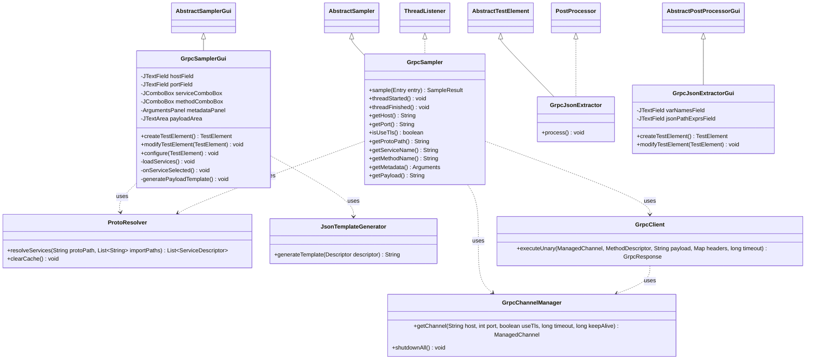

# gRPC Request Sampler JMeter Plugin

A production-grade, dynamic Apache JMeter plugin for testing gRPC unary services. It behaves like the native HTTP Request Sampler: it dynamically compiles `.proto` files, automatically populates available services/methods in dropdowns, builds request JSON templates, and supports variable substitutions, connection pooling, and metadata headers.

---

## Architecture and Design

The plugin is designed to run dynamic gRPC client executions without requiring pre-compiled stubs during development or build time.

### Class Diagram



### Components

1. **JMeter Sampler Engine (`GrpcSampler`)**: The core sampler class that JMeter executes. It reads UI parameters, resolves variables, resolves the service schema, uses the client to execute the call, and builds a `SampleResult` containing latency, payload sizes, and response content.
2. **Swing UI (`GrpcSamplerGui`)**: Built using Swing components. Integrates into JMeter's Native Look & Feel. Features a Target Configuration section, Proto Upload/Import directory management, dynamic Service/Method selection, an interactive Metadata key-value table, and a JSON Payload editor.
3. **Dynamic Proto Resolver (`ProtoResolver`)**: Compiles `.proto` schemas dynamically at runtime using `protoc-jar`, generating `Descriptors` recursively. Implements a thread-safe `ConcurrentHashMap` cache to avoid compiling files on every request.
4. **JSON Template Generator (`JsonTemplateGenerator`)**: Traverses any message `Descriptor` recursively and constructs a clean sample JSON representation.
5. **Connection Manager (`GrpcChannelManager`)**: Implements a connection pool that caches and reuses `ManagedChannel` instances matching host/port/security configurations to maximize throughput and minimize overhead.
6. **Execution Client (`GrpcClient`)**: Creates generic method calls using custom serialization/deserialization marshallers on `DynamicMessage`. Sets up context metadata and captures response headers and trailers asynchronously using a forwarding client call interceptor.
7. **JSON Extractor (`GrpcJsonExtractor`)**: Evaluates JSONPath expressions on the gRPC JSON response to store variables in the JMeter thread context.

---

## Package Structure

```
.
├── pom.xml                                # Maven Project Configuration
├── README.md                              # Documentation
├── src
│   ├── main
│   │   └── java
│   │       └── org
│   │           └── apache
│   │               └── jmeter
│   │                   └── protocol
│   │                       └── grpc
│   │                           ├── extractor
│   │                           │   ├── GrpcJsonExtractor.java      # Extractor Logic
│   │                           │   └── GrpcJsonExtractorGui.java   # Extractor GUI
│   │                           └── sampler
│   │                               ├── GrpcChannelManager.java     # Connection Pool
│   │                               ├── GrpcClient.java             # Generic Client
│   │                               ├── GrpcSampler.java            # Sampler Engine
│   │                               ├── GrpcSamplerGui.java         # Sampler GUI
│   │                               ├── JsonTemplateGenerator.java  # Template Gen
│   │                               └── ProtoResolver.java          # Dynamic Protoc compiler
│   └── test
│       ├── java
│       │   └── org
│       │       └── apache
│       │           └── jmeter
│       │               └── protocol
│       │                   └── grpc
│       │                       └── sampler
│       │                           ├── extractor
│       │                           │   └── GrpcJsonExtractorTest.java # Extractor Test
│       │                           ├── GrpcClientTest.java          # Client Test
│       │                           ├── GrpcSamplerTest.java         # Sampler Test
│       │                           ├── ProtoResolverTest.java       # Resolver Test
│       │                           └── TestServer.java              # Mock Server Utility
│       └── resources
│           └── hello.proto                                          # Sample proto
```

---

## GUI Mockup Layout

```
+-----------------------------------------------------------------------------------+
|  Name: [ gRPC Request Sampler                                                  ]  |
|  Comments: [                                                                   ]  |
|                                                                                   |
|  +-- Server Configuration -----------------------------------------------------+  |
|  | Target Host: [ localhost       ]   Port: [ 50051 ]   [x] Use TLS            |  |
|  | Connection Timeout (ms): [ 5000     ]   Deadline Timeout (ms): [ 10000     ]|  |
|  | Keep Alive (ms): [ 60000    ]                                               |  |
|  +-----------------------------------------------------------------------------+  |
|                                                                                   |
|  +-- Proto Management ---------------------------------------------------------+  |
|  | Proto Path: [ /path/to/hello.proto                      ]  [ Browse... ]     |  |
|  | Import Paths (comma-separated): [ /path/to/imports ]     [ Load / Refresh ] |  |
|  | Service: [ hello.HelloService                                           v ] |  |
|  | Method:  [ SayHello                                                     v ] |  |
|  +-----------------------------------------------------------------------------+  |
|                                                                                   |
|  +-- gRPC Metadata Headers ----------------------------------------------------+  |
|  | +-----------------------+-------------------------------------------------+ |  |
|  | | Key                   | Value                                           | |  |
|  | +-----------------------+-------------------------------------------------+ |  |
|  | | authorization         | Bearer ${token}                                 | |  |
|  | | correlation-id        | ${correlationId}                                | |  |
|  | +-----------------------+-------------------------------------------------+ |  |
|  | [ Add ]   [ Delete ]   [ Up ]   [ Down ]                                    |  |
|  +-----------------------------------------------------------------------------+  |
|                                                                                   |
|  +-- Request Payload (JSON) ---------------------------------------------------+  |
|  |                                                   [ Generate JSON Template ] |  |
|  |  {                                                                          |  |
|  |    "name": "${userName}",                                                   |  |
|  |    "age": 30,                                                               |  |
|  |    "hobbies": ["gaming", "performance-testing"]                             |  |
|  |  }                                                                          |  |
|  +-----------------------------------------------------------------------------+  |
+-----------------------------------------------------------------------------------+
```

---

## Build and Installation Guide

### Prerequisites
* Java 17+
* Apache JMeter 5.6+
* Maven 3.8+

### Step 1: Build the plugin
Run the following Maven package command in the root of the project:
```bash
mvn clean package
```
This compiles the code, executes all tests, and creates a shaded fat JAR under `target/`:
* `target/grpc-jmeter-sampler-1.0-SNAPSHOT-jar-with-dependencies.jar`

### Step 2: Install to JMeter
Copy the generated `-jar-with-dependencies.jar` into the `lib/ext` folder of your JMeter installation:
```bash
cp target/grpc-jmeter-sampler-1.0-SNAPSHOT-jar-with-dependencies.jar /path/to/jmeter/lib/ext/
```

### Step 3: Restart JMeter
Restart JMeter. The **gRPC Request** sampler and **gRPC JSON Extractor** post-processor will now appear in your sampler and post-processor context menus.

---

## Developer Guide

### Running local tests
The project contains unit and integration tests against a mock server that starts up automatically on a free local port. Run:
```bash
mvn test
```

### Mock Test Server (`TestServer.java`)
The embedded mock server can generate self-signed TLS certificates on-the-fly and processes requests dynamically. If you send the name `"throw_invalid"`, `"throw_unavailable"`, or `"throw_deadline"`, it simulates the corresponding gRPC status error code. This is very useful for testing downstream JMeter assertions and error handlings.

---

## Future Extension Points

The architecture is designed to support the following enhancements:

1. **Streaming RPCs**:
   - The generic client `GrpcClient` uses `MethodDescriptor.MethodType.UNARY` and `ClientCalls.blockingUnaryCall(...)`.
   - To support **Server Streaming**, **Client Streaming**, and **Bidirectional Streaming**, the sampler can implement `StreamObserver` and execute calls using `ClientCalls.asyncServerStreamingCall(...)`, `ClientCalls.asyncClientStreamingCall(...)`, or `ClientCalls.asyncBidiStreamingCall(...)` with custom callback handlers.
2. **Server Reflection API**:
   - An additional check box can be added to bypass loading `.proto` files entirely and instead inspect the target server schemas at runtime using gRPC's Server Reflection protocol via a `ServerReflectionClient`.
3. **gRPC-Web Support**:
   - The connection transport can be wrapped using a proxy or HTTP Client that frames binary gRPC messages over HTTP/1.1 or HTTP/2 using standard gRPC-Web content-types (`application/grpc-web`).

---

## Contribution Guide

1. Follow standard [Apache JMeter Coding Conventions](https://jmeter.apache.org/building.html).
2. Write unit tests for all new helper methods and classes.
3. Ensure formatting is clean, and write clear JavaDoc blocks.
4. To submit changes, build the shaded jar, ensure `mvn test` passes, and submit a PR to the JMeter plugins repository.
